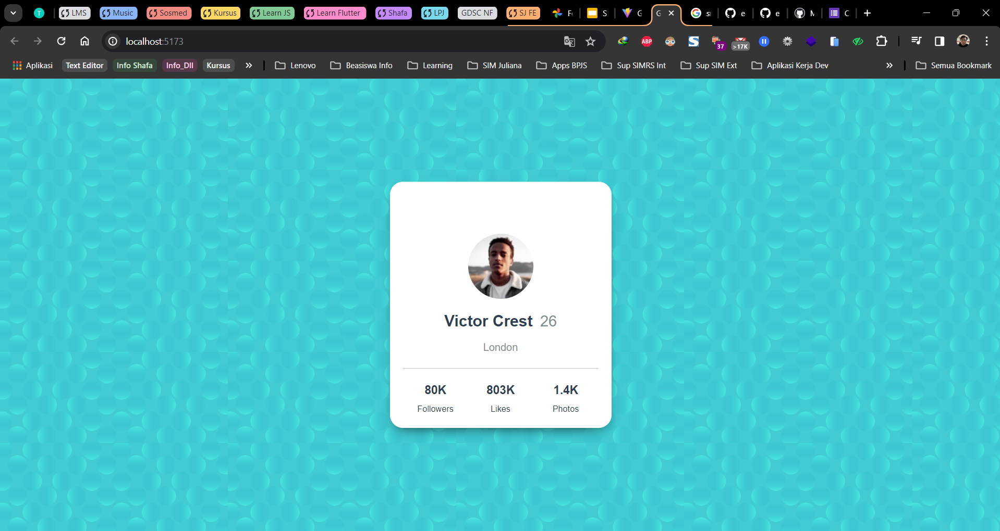

# Study Jam Frontend Day #2 

### Task FE DAY #2

- Pindahkan Proyek Study Jam 1 -> Dengan Kerangka React JS
- Menerapkan Metode Komponen React JS :
    - src/ :
        - App.jsx
        - Card_Profile.jsx
- Menerapkan Metode Props -> Agar Tipe Data Yang Diberikan atau diterima adalah string
- src/ :
    - Card_Profile.jsx 

 ### Hasil Implementasi
 

### Identifikasi Kebutuhan Untuk Membuat Halaman Kartu Profil (Card Profile)

### Struktur Proses Berfikir Sebagai Frontend (FE) :
- Kotak Kartu Profile 
    - Biodata Profil - Pengguna Aplikasi
        - Gambar Profil 
        - Nama Profil
        - Umur Profil
        - Lokasi Profil
    - Status Profile - Pengguna Aplikasi
        - Jumlah Followers 
        - Jumlah Suka 
        - Jumlah Foto

Struktur Implemetasi Thinking Dalam Kodingan di HTML :
- kotak_profil
    - biodata_profil
        - gambar_profil
        - nama
        - umur 
        - lokasi_tempat
    - status profile
        - jumlah follow
        - jumlah suka
        - jumlah foto

### Teknologi Yang Di Gunakan Dalam Membuat Aplikasi
- HTML
- CSS
- JS
- Framework React.js

 ### Sumber Design
 https://www.frontendmentor.io/

# Study Jam Frontend Day #1

## [GitHub Repository](https://github.com/ekomh170/gdsc_study_Jam_fe_1.git)

Di sini Anda dapat menemukan detail implementasi dan proyek studi Jam frontend hari pertama.
